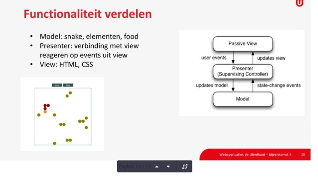
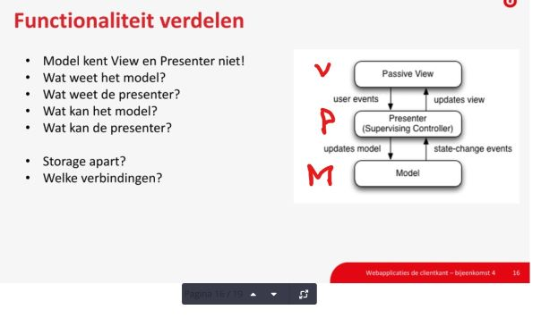
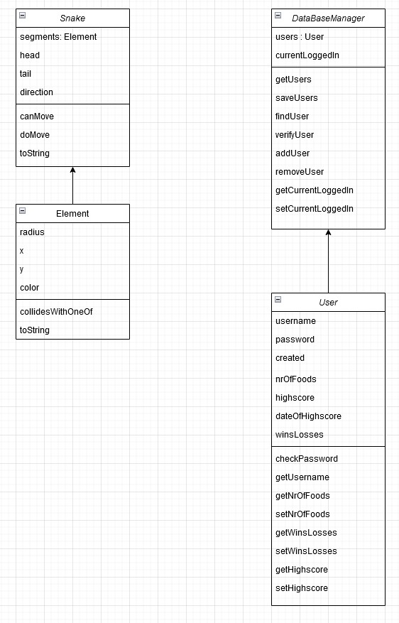

# Webapplicaties: de clientkant
.[Opdracht 2](Opdracht2.md)
[_metadata_:title]:-"Mijn Spelletjes Site"
[_metadata_:author]:-"Martin van Diest (s852192418)"

## Opdracht 2

### Opzet

We hebben een "spelletjes site" gemaakt volgens de requirements voor opdracht 1. Deze zouden we dan gebruiken 
als framework voor Opdracht 2. Waarin we het snake-gedeelte gaan implementeren.

Verder moest er ook nog een Login-functionailteit bij komen. Waarbij verschillende gegevens van de gebruikers
bijgehouden konden worden.
Hierbij konden we kiezen tussen localStorage, Shared Storage of indexedDB. Wij hebben gekozen voor localStorage.
Hier moeten we goed rekening houden met het feit dat de informatie die we naar de computer van de gebruiker sturen 
als 1 string gestuurd moet worden. 
Hierbij konden we goed genruik maken van de JSON eigenschappen. En een library die JSON kan parsen en stringifyen.

Verder hebben we om het geheel wat makkelijker te maken, een DatabaseManager gemaakt, die de communicatie met de 
localStorage voor zijn rekening neemt. En de data die we nodig hebben in de juiste vorm aanlevert.

### Samenwerking

Remco Verkade en Martin van Diest. Dat is het team dat hieraan gewerkt heeft.
We hielden contact via de audiokanalen en chat van discord. De open Universiteit heeft een eigen discord server waar
we gebruik van konden maken.

Verder hadden we alles op een github repository staan. Waar we allebei aan konden werken. En waar we de code konden
delen en bespreken.

### Ontwerp keuzes

Volgens de opdracht omschrijving moesten we gebruik maken van MVP. Model View Presenter.

Alle klassen en een ejson-fil met de scores hebben we in MODEL gezet.
De HTML en CSS hebben we in VIEW gezet.
En in PRESENTER staat alles wat communiceert tussen MODEL en VIEW.
Hier hebben we zoveel mogelijk de verschillende functionaliteiten bij elkaar gehouden om de code overzichtelijk te houden.
Alsmede om coupling zo laag mogelijk te houden en de code zo makkelijk mogelijk te kunnen testen.

We hebben wat tests toegevoegd die we met QUnit hebben gemaakt. Deze zijn te vinden in de map test.

### Domein Modellen

Voor de verschillende klassen die we gebruiken hebben we de volgende domein modellen gebruikt :

### DOCS

De documentatie die we hebben gemaakt met JSDOC is te vinden in de map docs.
Door gebruik te maken van de docstring in de code kun je heel gemakkelijk de documentatie genereren.
Dit is te zien in de door ons geleverde documentatie. Hierbij kan iemand heel overzichtelijk zien welke Klassen
er gemaakt en gebruikt zijn. En welke methodes en properties deze hebben.

### Conclusie

Gezien de tijdsdruk hebben we het niet helemaal kunnen af krijgen zoals we het graag hadden gezien.
Het was een zeer leerzame cursus en een erg leuke opdracht. De verschillende aspecten die aan bod kwamen 
waren erg interessant.
