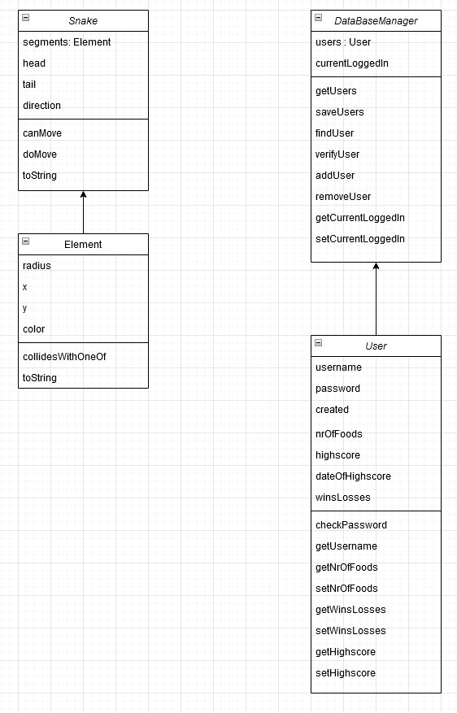
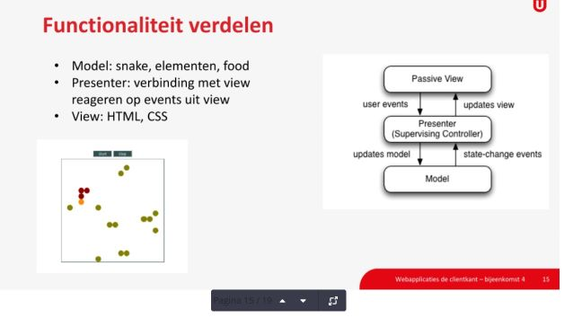
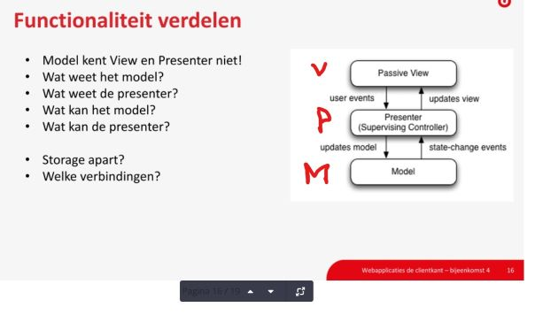

# Mijn Spelletjes Site

[_metadata_:title]:-"Mijn Spelletjes Site"
[_metadata_:author]:-"Martin van Diest"


## Starten docker

Het clonen van de Repository hoeft maar 1 keer! Alleen wanneer je deze nog niet eerde rhebt binnegehaald.
(als je deze stap al eens hebt uitgevoerd, kun je meteen naar Pull)
Eerst halen we de repository binnen :
```
git clone https://github.com/Tri3st/WebApplicaties.git
```

Als je dat eenmaal hebt gedaan kun je met het volgende commando de repo updaten (Nieuwste versie binnenhalen):
```
git pull
```

Ga naar de juiste branch:
```
git switch martin
```

Maak een docker met docker compose: 

```
docker compose up --build
```

'In' de container gaan :
```
docker exec -it martin-web-1 sh
```

## Beginnetje gemaakt

Ik heb een begin gemaakt met de code voor opdracht 2.
Kijk er even doorheen of je er mee kan leven. Of misschien vind je
dat iets niet goe dis, of helemaal anders moet. Laat dat vooral weten.

Ik denk dat het handig is, dat we met deze verder gaan.

En steeds de veranderingen hier naar de branch 'martin' pushen.

Laat maar weten wat je ervan vindt zover.

MARTIN

## Domein Modellen

Voor de verschillende klassen die we gebruiken hebben we de volgende domein modellen gebruikt :




## DOCS

De JS-DOCS worden automatisch gegenereerd en zijn te zien als je naar http://localhost:80/docs navigeert in je browser.

## MVP

### Info uit de Bijeenkomst





### Model

Je domein. Server communicatie of data. 

### (Passive) View

DOM manipulatie (via jquery) en HTML 

## presenter

Event-Handling, User Interactie